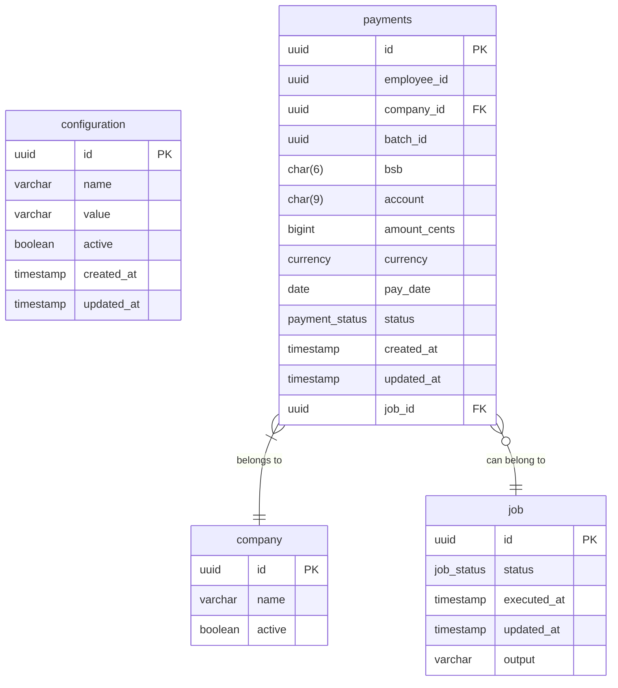
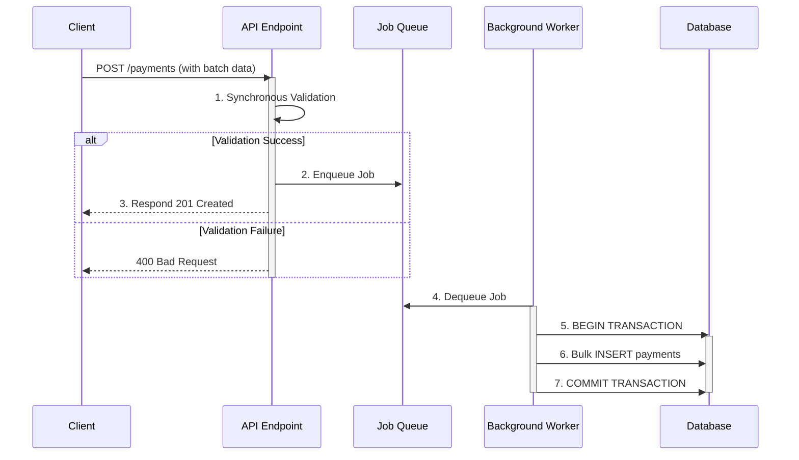
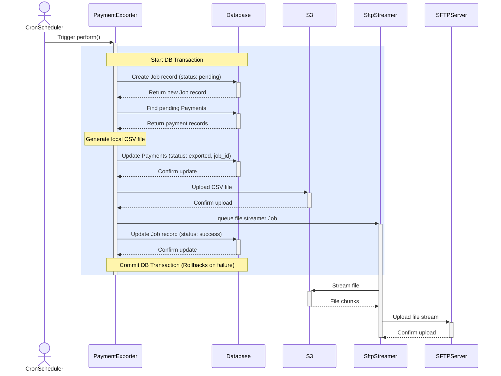

# **Salary Payment File Exporter**

This is a backend service for a payroll company. The system is designed to accept salary payment requests from internal systems, store them in a PostgreSQL database, and generate a daily export file to S3 and then push to bank's SFTP server

### **Core Features**

*    POST /payments: A REST endpoint to accept batches of payment requests.
*    A daily file export process that generates a .txt file for the bank.

### **Tech Stack**

    Ruby, SideKiq, Redis, Postgresql, AWS S3, SFTP

### Local Setup

run `docker compose up -d`

execute migration `bundle exec rake db:migrate`

start server `bundle exec puma -p 4567`

start sidekiq worker `bundle exec sidekiq -r ./app.rb`

to execute Unit test case `bundle exec rspec`

### **Entities**

### **API contracts**
POST /payments

Sample request
```json
POST /payments HTTP/1.1
Content-Type: application/json

{
    "company_id": "123",
    "batch_id": "931d1eb0-cd54-4b54-8fba-9893c93cebf1",
    "payments": [
{
    "employee_id": "1e0f4e4a-2bb3-48c6-8e15-6fe8d8ed0999",
    "bank_bsb": "062000",
    "bank_account": "12345678",
    "amount_cents": 250000,
    "currency": "AUD",
    "pay_date": "2025-10-09"
}
]
}
```
Sample response
```json
HTTP/1.1 201 Created
Location: /payments/batches/a1b2c3d4-e5f6-7890-1234-567890abcdef
{"message":"Accepted: A batch of 2 payments has been enqueued for processing."}
```

Sequence diagram

### Batch job

Sequence diagram

#### Batch job analysis:

Pros:
*   Atomic & Safe: Uses a database transaction to ensure data integrity. SFTP file transfer and database update are atomic and can be safely retried

Cons:
*    Long-Running Transaction: Possible database dead-lock due to long running transaction. Possible fix is to use a staging table
*    High Memory Use:Reading the entire file into memory for the S3 upload doesn't scale well for very large files. Possible improvement: directly stream file to S3
